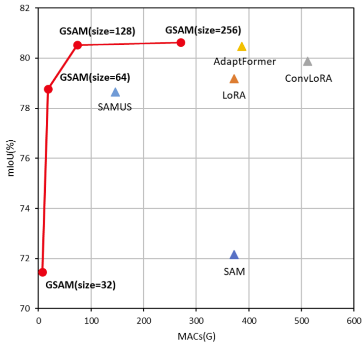

# Generalized SAM: Efficient Fine-Tuning of SAM for Variable Input Image Sizes (ECCV2024 Workshop)
[](https://arxiv.org/pdf/2408.12406)


This repo is the official implementation for *Generalized SAM* accepted by ECCV2024 Workshop [*Computational Aspects of Deep Learning (CADL)*](https://sites.google.com/nvidia.com/cadl2024).

## Highlights
<div align="center">
   
</div>


- **Training using random cropping**: Our Generalized SAM (GSAM) can cope with variable input image sizes, allowing random cropping to be used the first time during fine-tuning for SAM.
- **Multi-scalce AdaptFormer**: GSAM can use multi-scale features during fine-tuning for SAM.
- **Low computational cost of training**: compared to the conventional SAM fine-tuning methods, GSAM can significantly reduce the computational training cost and GPU memories.


## Installation
Following [Segment Anything](https://github.com/facebookresearch/segment-anything), `python=3.8.16`, `pytorch=1.8.0`, and `torchvision=0.9.0` are used in GSAM.
1. Clone this repository.
   ```
   git clone https://github.com/usagisukisuki/G-SAM.git
   cd G-SAM
   ```
2. Install Pytorch and TorchVision. (you can follow the instructions here)
3. Install other dependencies.
   ```
   pip install -r requirements.txt
   ```

## Checkpoints
We use checkpoint of SAM in [vit_b](https://github.com/facebookresearch/segment-anything) version.
Please download from [SAM](https://github.com/facebookresearch/segment-anything) and extract them under "models/Pretrained_model".

```
models
├── Pretrained_model
    ├── sam_vit_b_01ec64.pth
```

## Dataset
Step 1 : Please download from [[CamVid]](https://www.kaggle.com/datasets/carlolepelaars/camvid), [[M-Building]](https://www.kaggle.com/datasets/balraj98/massachusetts-buildings-dataset), [[ISBI2012]](https://github.com/hoangp/isbi-datasets), [[Kvasir-SEG]](https://www.kaggle.com/datasets/debeshjha1/kvasirseg), [[Synapse]](https://www.synapse.org/Synapse:syn3193805/wiki/89480), [[Cityscapes]](https://www.cityscapes-dataset.com/), [[Trans10k]](https://github.com/xieenze/Segment_Transparent_Objects). 

Step 2 : please extract them under "Dataset", and make them look like this:
```
Dataset
├── CamVid
├── M-building
├── ISBI2012
├── Kvasir
├── Synapse
├── Citycapes
├── Trans10k

```


## Fine tuning on SAM
### Binary segmentation
If we prepared the binary segmentation dataset (e.g. ISBI2012), we can directly run the following code to train the model with single GPU.
```
python3 train.py --gpu 0 --dataset 'ISBI2012' --out result_sam --modelname 'SAM' --batchsize 8
```
If we want to utilize multi GPUs, we can directly run the following code.
```
CUDA_VISIBLE_DEVICES=0,1 python3 train.py --dataset 'ISBI2012' --out result_sam --modelname 'SAM' --batchsize 8 --multi
```

### Multi-class segmentation
If we prepared the multi-class segmentaiton dataset (e.g. Cityscapes), we can directly run the following code to train the model with single GPU.
```
python3 train.py --gpu 0 --dataset 'Cityscapes' --out result_sam --modelname 'SAM' --batchsize 8 --num_classes=19 --multimask_output=True
```

## Fine tuning on Generalised SAM
We can try to use our GSAM.
Please run the following code  to train the improved SAM.

```
python3 train.py --gpu 0 --dataset 'ISBI2012' --modelname 'GSAM'
```

## Fine tuning on SAM with Anything
We can also try to use variour adaptation methods.
Please run the following code to train the improved SAM.

```
python3 train.py --gpu 0 --dataset 'ISBI2012' --modelname 'SAM_LoRA'
python3 train.py --gpu 0 --dataset 'ISBI2012' --modelname 'SAM_ConvLoRA'
python3 train.py --gpu 0 --dataset 'ISBI2012' --modelname 'SAM_AdaptFormer'
python3 train.py --gpu 0 --dataset 'ISBI2012' --modelname 'SAMUS'
```

## Results
|Method|CamVid|M-Building|ISBI|Kvasior-SEG|Synapse|Cityscapes|Trans10k|
|SAM|:---:|:---:|:---:|:---:|:---:|:---:|:---:|


## Citation
```
@article{kato2024generalized,
  title={Generalized SAM: Efficient Fine-Tuning of SAM for Variable Input Image Sizes},
  author={Kato, Sota and Mitsuoka, Hinako and Hotta, Kazuhiro},
  journal={arXiv preprint arXiv:2408.12406},
  year={2024}
}
```
